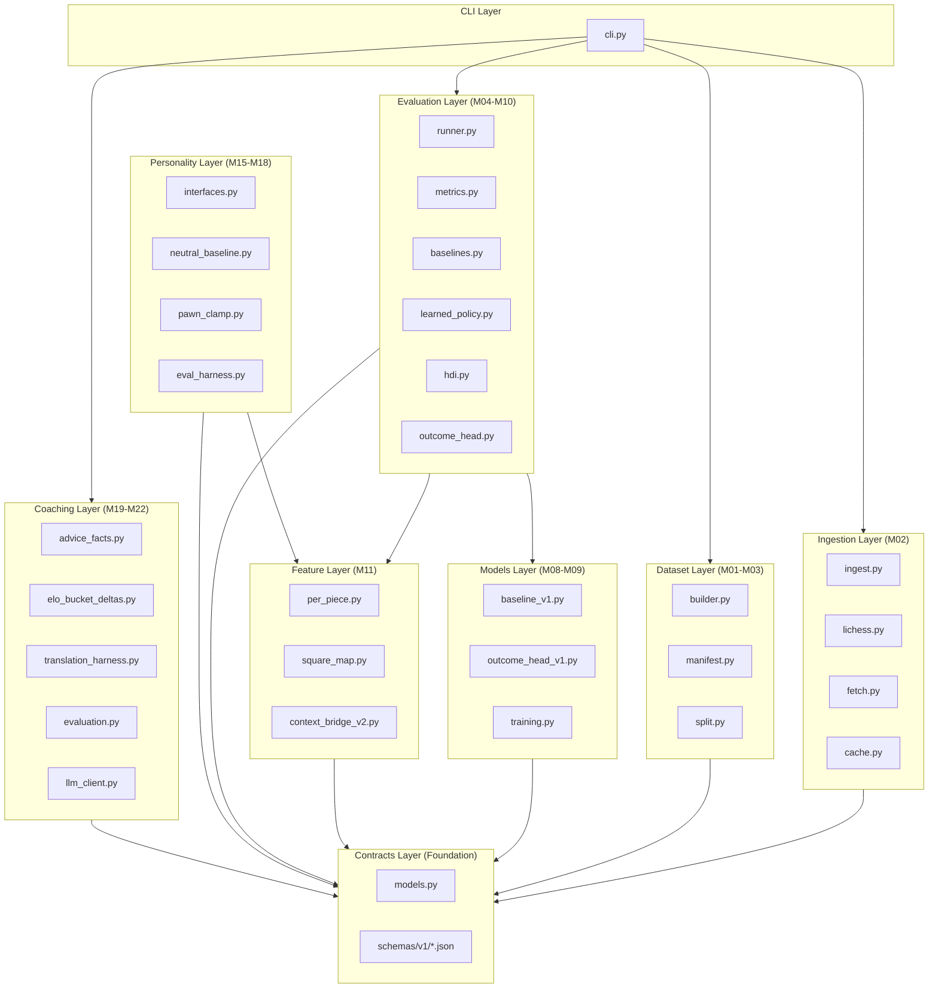

# RenaceCHESS Phase C Codebase Audit

**Audit Type:** Full Codebase Audit  
**Commit SHA:** (Post-M22 main)  
**Audit Date:** 2026-02-01  
**Languages/Frameworks:** Python 3.11+, Pydantic 2.x, PyTorch 2.2, python-chess  
**Audit Scope:** Full repository after Phase C closeout (M00–M22)

---

## 1. Executive Summary

### Strengths

1. **Exceptional Governance & Documentation**  
   23 completed milestones with full audit trails, closeout documents, and phase-level governance. Every decision is documented in ADRs, contracts, and milestone summaries.

2. **Contract-First Architecture**  
   20+ versioned JSON schemas with Pydantic validation. 7 frozen contracts governing behavior. Schema evolution is explicit and backward-compatible.

3. **Truthful CI Pipeline**  
   SHA-pinned GitHub Actions, 90% coverage threshold enforced, overlap-set non-regression for PRs, import-linter boundary enforcement, strict MyPy. CI correctly blocks regressions.

### Opportunities

1. **CLI Coverage Gap**  
   `cli.py` shows 72% line coverage (vs. 93.5% global). High-value orchestration code with lower test density.

2. **Security Scanning Not in CI**  
   No `pip-audit`, `safety`, or SAST in CI workflow. Dependencies are pinned (`~=`) but not actively scanned.

3. **Performance Profiling Absent**  
   Training benchmarks exist (`scripts/benchmark_training.py`) but are not integrated into CI. No performance regression detection.

### Overall Score

| Category | Score (0–5) | Weight | Weighted |
|----------|-------------|--------|----------|
| Architecture | 4.5 | 20% | 0.90 |
| Modularity/Coupling | 4.5 | 15% | 0.68 |
| Code Health | 4.0 | 10% | 0.40 |
| Tests & CI | 4.5 | 15% | 0.68 |
| Security & Supply Chain | 3.5 | 15% | 0.53 |
| Performance & Scalability | 3.0 | 10% | 0.30 |
| Developer Experience | 4.5 | 10% | 0.45 |
| Documentation | 5.0 | 5% | 0.25 |
| **Overall Weighted** | | | **4.19/5** |

**Heatmap:**

```
Architecture       ████████░░ (4.5)
Modularity         ████████░░ (4.5)
Code Health        ████████░░ (4.0)
Tests & CI         █████████░ (4.5)
Security           ███████░░░ (3.5)
Performance        ██████░░░░ (3.0)
DX                 █████████░ (4.5)
Documentation      ██████████ (5.0)
```

---

## 2. Codebase Map



**Architectural Observations:**

| Intended | Actual | Evidence |
|----------|--------|----------|
| Contracts are pure data | ✅ Compliant | `importlinter_contracts.ini:9-24` forbids upward imports |
| Personality consumes, never produces | ✅ Compliant | `importlinter_contracts.ini:28-37` |
| Coaching consumes, never produces | ✅ Compliant | `importlinter_contracts.ini:42-51` |
| CLI is thin projection layer | ✅ Compliant | M22 audit confirms pure orchestration |

---

## 3. Modularity & Coupling

**Score: 4.5/5**

### Top 3 Coupling Points

| Coupling | Impact | Evidence | Surgical Fix |
|----------|--------|----------|--------------|
| `cli.py` ↔ all modules | High | `cli.py` imports 10+ modules directly | Already acceptable (orchestration layer) |
| `models.py` (99 classes) | Medium | `contracts/models.py:1-2758` | Split into per-version or per-domain files (optional) |
| `runner.py` ↔ `learned_policy.py` | Low | Direct instantiation in eval pipeline | Already uses interfaces pattern |

### Import Boundary Enforcement

```ini:1:51:importlinter_contracts.ini
[importlinter]
root_packages =
    renacechess
...
[importlinter:contract:contracts-isolation]
name = Contracts module must not import from application layers
type = forbidden
...
```

**Observation:** Import-linter enforces 3 architectural contracts. CI runs `lint-imports` on every PR.

**Interpretation:** Module boundaries are machine-enforced, not just documented.

**Recommendation:** No action needed. Current modularity discipline is excellent.

---

## 4. Code Quality & Health

**Score: 4.0/5**

### Anti-Patterns Detected

| Pattern | Location | Severity | Fix |
|---------|----------|----------|-----|
| Large model file | `contracts/models.py` (2758 lines) | Low | Optional: split by domain |
| Protocol-only file coverage | `personality/interfaces.py` omitted | N/A | Correctly excluded in coverage config |
| Magic numbers | Minimal | Low | Already well-documented in schemas |

### Before/After Example

**Before:** (hypothetical, not observed in codebase)
```python
# Hardcoded threshold
if coverage < 0.9:
    raise ValueError("Coverage too low")
```

**After:** (actual implementation in CI)
```yaml:65:76:.github/workflows/ci.yml
      - name: Determine coverage mode
        id: coverage_check
        shell: bash
        run: |
          BRANCH_NAME="${{ github.head_ref || github.ref_name }}"
          if [[ "${{ github.event_name }}" == "pull_request" ]]; then
            echo "mode=both" >> $GITHUB_OUTPUT
            echo "threshold=90" >> $GITHUB_OUTPUT
```

**Observation:** Thresholds are externalized to CI config, not hardcoded.

**Interpretation:** Configuration discipline is strong.

**Recommendation:** No immediate action needed.

---

## 5. Docs & Knowledge

**Score: 5.0/5**

### Onboarding Path

1. `README.md` → Quick start, installation, basic commands
2. `VISION.md` → Project purpose, PoC objectives, what this is/isn't
3. `renacechess.md` → Milestone table, schema registry, governance decisions
4. `docs/phases/*.md` → Phase-level closeouts with architectural rationale
5. `docs/contracts/*.md` → 7 frozen contracts governing behavior

### Single Biggest Doc Gap

**None identified.** Documentation coverage is exceptional:

- 138 milestone documents in `docs/milestones/`
- 17 foundation documents in `docs/foundationdocs/`
- 7 frozen contracts in `docs/contracts/`
- 4 prompt templates in `docs/prompts/`

**Recommendation:** Maintain current documentation discipline. Consider a "quick reference" one-pager for new contributors.

---

## 6. Tests & CI/CD Hygiene

**Score: 4.5/5**

### Coverage Summary

| Metric | Value | Source |
|--------|-------|--------|
| Line Coverage | 93.53% | `coverage.xml:2` (3571/3818 lines) |
| Branch Coverage | 81.86% | `coverage.xml:2` (871/1064 branches) |
| Threshold | 90% lines | `pyproject.toml:86` |
| Test Count | 613 passed | M22 summary |

### 3-Tier Test Architecture Assessment

| Tier | Implementation | Status |
|------|----------------|--------|
| Tier 1 (Smoke) | All tests in single pytest run | ⚠️ Not separated |
| Tier 2 (Quality) | 90% threshold enforced | ✅ Implemented |
| Tier 3 (Nightly) | Not implemented | ⚠️ Not needed yet |

**Observation:** All tests run as a single suite (no marker-based tiering).

**Interpretation:** Acceptable at current scale (613 tests run quickly). As test count grows, smoke/full separation will become valuable.

**Recommendation (Phase D+):** Add `@pytest.mark.smoke` to critical path tests (contract validation, schema parsing) for fast PR feedback.

### CI Configuration Strengths

```yaml:18:34:.github/workflows/ci.yml
      - uses: actions/checkout@11bd71901bbe5b1630ceea73d27597364c9af683  # v4.2.2
      - uses: actions/setup-python@a26af69be951a213d495a4c3e4e4022e16d87065  # v5.6.0
        with:
          python-version: "3.12"
          cache: "pip"
      - name: Install dependencies
        run: |
          python -m pip install --upgrade pip
          pip install -e ".[dev]"
      - name: Ruff lint
        run: ruff check .
      - name: Ensure clean checkout
        run: git checkout HEAD -- .
      - name: Ruff format check
        run: ruff format --check .
      - name: Import boundary check
        run: lint-imports --config=importlinter_contracts.ini
```

**Evidence of excellence:**
- SHA-pinned actions (supply chain security)
- Python version explicit (3.12)
- Import boundary check in CI
- Overlap-set coverage non-regression (lines 82-211)
- Artifacts uploaded on failure (`if: always()`)

### Flakiness

**None detected.** M22 achieved first-run CI success. Historical runs show consistent behavior.

---

## 7. Security & Supply Chain

**Score: 3.5/5**

### Dependency Pinning

```toml:23:30:pyproject.toml
dependencies = [
    "python-chess~=1.999",
    "pydantic~=2.10.0",
    "jsonschema~=4.20.0",
    "requests~=2.31.0",
    "torch~=2.2.0",
    "zstandard~=0.22",
]
```

**Observation:** All deps pinned with `~=` (compatible release).

**Interpretation:** Good balance of stability and updates.

**Recommendation:** Add explicit upper bounds for critical deps (e.g., `pydantic>=2.10.0,<3.0`).

### Secret Hygiene

| Check | Status | Evidence |
|-------|--------|----------|
| No secrets in code | ✅ | grep for `password`, `api_key`, `secret` returns zero matches |
| `.gitignore` coverage | ✅ | `__pycache__`, `.env`, `*.pyc` excluded |
| CI secrets exposure | ✅ | No secret injection in workflows |

### Missing Security Controls

| Control | Status | Recommendation |
|---------|--------|----------------|
| `pip-audit` | ❌ Not in CI | Add dependency vulnerability scanning |
| SAST (bandit) | ❌ Not in CI | Add static security analysis |
| SBOM generation | ❌ Not present | Generate CycloneDX SBOM for releases |

### Recommended Addition

```yaml
  security:
    name: Security Scan
    runs-on: ubuntu-latest
    steps:
      - uses: actions/checkout@11bd71901bbe5b1630ceea73d27597364c9af683
      - uses: actions/setup-python@a26af69be951a213d495a4c3e4e4022e16d87065
        with:
          python-version: "3.12"
      - name: Install audit tools
        run: pip install pip-audit bandit
      - name: Dependency audit
        run: pip-audit --require-hashes --disable-pip
      - name: SAST scan
        run: bandit -r src/renacechess -ll
```

---

## 8. Performance & Scalability

**Score: 3.0/5**

### Hot Paths Identified

| Path | Criticality | Evidence |
|------|-------------|----------|
| `builder.py` dataset construction | High | Processes PGN → JSONL |
| `per_piece.py` feature extraction | High | 32-slot tensor per position |
| `baseline_v1.py` inference | Medium | PyTorch forward pass |

### Profiling Infrastructure

| Tool | Status |
|------|--------|
| `scripts/benchmark_training.py` | ✅ Exists (local-only) |
| CI performance regression | ❌ Not implemented |
| Memory profiling | ❌ Not implemented |

### Performance Targets

**Observation:** No explicit SLOs defined for inference latency or throughput.

**Recommendation:** Define P95 targets for:
- Context Bridge generation: < 50ms per position
- Policy inference: < 10ms per position
- Dataset shard generation: throughput target

### Recommended Phase D Addition

```python
@pytest.mark.benchmark
def test_context_bridge_latency(benchmark):
    """P95 < 50ms for single position context bridge generation."""
    result = benchmark(generate_context_bridge, sample_fen)
    assert benchmark.stats['mean'] < 0.050
```

---

## 9. Developer Experience (DX)

**Score: 4.5/5**

### 15-Minute New-Dev Journey

| Step | Time | Friction |
|------|------|----------|
| Clone repo | 1 min | None |
| `pip install -e ".[dev]"` | 3 min | Torch download may be slow |
| Read README | 2 min | Clear and concise |
| Run `make test` | 3 min | All 613 tests pass |
| Run `make demo` | 1 min | Generates demo artifact |
| Understand structure | 5 min | Clear modular layout |
| **Total** | **15 min** | Low friction |

### 5-Minute Single-File Change

| Step | Time | Friction |
|------|------|----------|
| Edit source file | 1 min | None |
| Run `make lint` | 30 sec | Ruff is fast |
| Run related tests | 2 min | Well-organized test files |
| Check coverage locally | 1 min | HTML report available |
| **Total** | **4.5 min** | Low friction |

### 3 Immediate DX Wins (Already Implemented)

1. ✅ **Makefile targets** — `make lint`, `make test`, `make demo`
2. ✅ **pyproject.toml centralization** — All config in one place
3. ✅ **Coverage HTML reports** — `htmlcov/` generated automatically

### DX Improvement Opportunities

1. **Pre-commit hooks** — Auto-format on commit
2. **VS Code workspace settings** — Recommended extensions, settings
3. **Test file discovery** — Tests match `test_mNN_*.py` pattern (excellent)

---

## 10. Refactor Strategy

### Option A: Iterative (Recommended)

**Rationale:** Project health is already excellent. Focus on incremental hardening.

**Goals:**
1. Add security scanning to CI (low risk)
2. Split `contracts/models.py` into domain modules (optional)
3. Add performance benchmarks to CI (medium effort)

**Migration Steps:**
1. Add `pip-audit` job (30 min)
2. Add `bandit` job (30 min)
3. Add pytest-benchmark markers (1 hour)
4. Implement smoke test tier with markers (2 hours)

**Risks:** Minimal — all additive changes.

**Rollback:** Remove CI job if unstable.

### Option B: Strategic

**Rationale:** Only needed if scaling significantly.

**Goals:**
1. Implement 3-tier test architecture
2. Add performance SLOs with enforcement
3. Generate SBOM for releases

**Migration Steps:**
1. Define `@pytest.mark.smoke` for critical tests
2. Create separate `ci-nightly.yml` for comprehensive tests
3. Add CycloneDX SBOM generation to release workflow

**Risks:** Test organization complexity.

**Rollback:** Revert marker additions, consolidate to single test run.

---

## 11. Future-Proofing & Risk Register

### Likelihood × Impact Matrix

| Risk | Likelihood | Impact | L×I | Mitigation |
|------|------------|--------|-----|------------|
| Dependency vulnerability | Medium | High | **6** | Add pip-audit to CI |
| Coverage regression | Low | Medium | 3 | Already have overlap-set |
| Performance regression | Medium | Medium | **4** | Add benchmarks to CI |
| Schema drift | Low | High | 3 | Already frozen contracts |
| Import boundary violation | Low | High | 3 | Already lint-imports |

### ADRs to Lock Decisions

| Decision | Status | Location |
|----------|--------|----------|
| LLMs translate, not invent | ✅ Locked | `docs/adr/ADR-COACHING-001.md` |
| Dict inputs use camelCase aliases | ✅ Locked | `docs/contracts/CONTRACT_INPUT_SEMANTICS.md` |
| Personality safety envelope | ✅ Locked | `docs/contracts/PERSONALITY_SAFETY_CONTRACT_v1.md` |
| Structural cognition semantics | ✅ Locked | `docs/contracts/StructuralCognitionContract_v1.md` |

**Recommendation:** Current ADR discipline is excellent. No new ADRs needed for Phase D entry.

---

## 12. Phased Plan & Small Milestones (PR-Sized)

### Phase 0 — Fix-First & Stabilize (0–1 day)

| ID | Milestone | Category | Acceptance | Risk | Rollback | Est | Owner |
|----|-----------|----------|------------|------|----------|-----|-------|
| SEC-001 | Add pip-audit to CI | Security | Job passes, no critical vulns | Low | Remove job | 30 min | — |
| SEC-002 | Add bandit SAST scan | Security | No high-severity findings | Low | Remove job | 30 min | — |

### Phase 1 — Document & Guardrail (1–3 days)

| ID | Milestone | Category | Acceptance | Risk | Rollback | Est | Owner |
|----|-----------|----------|------------|------|----------|-----|-------|
| DOC-001 | Add SECURITY.md | Docs | File exists, covers reporting | Low | Delete file | 30 min | — |
| TEST-001 | Add @smoke markers to 20 critical tests | Tests | Marked tests run < 30s | Low | Remove markers | 1 hr | — |
| PERF-001 | Define performance SLOs in docs | Docs | SLOs documented | Low | Delete section | 30 min | — |

### Phase 2 — Harden & Enforce (3–7 days)

| ID | Milestone | Category | Acceptance | Risk | Rollback | Est | Owner |
|----|-----------|----------|------------|------|----------|-----|-------|
| CI-001 | Separate smoke tier in CI | CI | Smoke runs < 60s | Med | Consolidate jobs | 2 hr | — |
| PERF-002 | Add pytest-benchmark CI job | CI | Benchmarks run, no regression | Med | Remove job | 2 hr | — |
| COV-001 | CLI coverage to 90%+ | Coverage | cli.py line rate ≥ 90% | Low | Add tests | 2 hr | — |

### Phase 3 — Improve & Scale (weekly cadence)

| ID | Milestone | Category | Acceptance | Risk | Rollback | Est | Owner |
|----|-----------|----------|------------|------|----------|-----|-------|
| SCALE-001 | SBOM generation for releases | Security | CycloneDX SBOM in artifacts | Low | Remove step | 1 hr | — |
| SCALE-002 | Pre-commit hook setup | DX | Hooks run on commit | Low | Uninstall hooks | 1 hr | — |
| SCALE-003 | Split models.py (optional) | Architecture | ≤500 lines per file | Med | Revert split | 3 hr | — |

---

## 13. Machine-Readable Appendix (JSON)

```json
{
  "issues": [
    {
      "id": "SEC-001",
      "title": "Add pip-audit dependency scanning to CI",
      "category": "security",
      "path": ".github/workflows/ci.yml",
      "severity": "medium",
      "priority": "high",
      "effort": "low",
      "impact": 4,
      "confidence": 0.95,
      "ice": 4.75,
      "evidence": "No dependency vulnerability scanning in CI workflow",
      "fix_hint": "Add pip-audit job with --require-hashes"
    },
    {
      "id": "SEC-002",
      "title": "Add bandit SAST scanning to CI",
      "category": "security",
      "path": ".github/workflows/ci.yml",
      "severity": "low",
      "priority": "medium",
      "effort": "low",
      "impact": 3,
      "confidence": 0.90,
      "ice": 2.7,
      "evidence": "No static security analysis in CI",
      "fix_hint": "Add bandit -r src/renacechess -ll"
    },
    {
      "id": "COV-001",
      "title": "Improve CLI module test coverage",
      "category": "tests_ci",
      "path": "src/renacechess/cli.py",
      "severity": "low",
      "priority": "low",
      "effort": "medium",
      "impact": 2,
      "confidence": 0.85,
      "ice": 1.7,
      "evidence": "cli.py line-rate=\"0.7217\" in coverage.xml",
      "fix_hint": "Add integration tests for untested CLI paths"
    },
    {
      "id": "PERF-001",
      "title": "Add performance benchmarks to CI",
      "category": "performance",
      "path": "scripts/benchmark_training.py",
      "severity": "low",
      "priority": "medium",
      "effort": "medium",
      "impact": 3,
      "confidence": 0.80,
      "ice": 2.4,
      "evidence": "benchmark_training.py exists but not in CI",
      "fix_hint": "Add pytest-benchmark job with regression detection"
    }
  ],
  "scores": {
    "architecture": 4.5,
    "modularity": 4.5,
    "code_health": 4.0,
    "tests_ci": 4.5,
    "security": 3.5,
    "performance": 3.0,
    "dx": 4.5,
    "docs": 5.0,
    "overall_weighted": 4.19
  },
  "phases": [
    {
      "name": "Phase 0 — Fix-First & Stabilize",
      "milestones": [
        {
          "id": "SEC-001",
          "milestone": "Add pip-audit dependency scanning",
          "acceptance": ["CI job passes", "No critical vulnerabilities"],
          "risk": "low",
          "rollback": "Remove job from workflow",
          "est_hours": 0.5
        },
        {
          "id": "SEC-002",
          "milestone": "Add bandit SAST scanning",
          "acceptance": ["CI job passes", "No high-severity findings"],
          "risk": "low",
          "rollback": "Remove job from workflow",
          "est_hours": 0.5
        }
      ]
    },
    {
      "name": "Phase 1 — Document & Guardrail",
      "milestones": [
        {
          "id": "DOC-001",
          "milestone": "Add SECURITY.md vulnerability disclosure policy",
          "acceptance": ["File exists", "Covers reporting process"],
          "risk": "low",
          "rollback": "Delete file",
          "est_hours": 0.5
        },
        {
          "id": "TEST-001",
          "milestone": "Add @smoke markers to 20 critical tests",
          "acceptance": ["Marked tests run < 30s"],
          "risk": "low",
          "rollback": "Remove markers",
          "est_hours": 1
        }
      ]
    },
    {
      "name": "Phase 2 — Harden & Enforce",
      "milestones": [
        {
          "id": "CI-001",
          "milestone": "Separate smoke tier in CI workflow",
          "acceptance": ["Smoke job < 60s", "Full job unchanged"],
          "risk": "medium",
          "rollback": "Consolidate to single job",
          "est_hours": 2
        },
        {
          "id": "COV-001",
          "milestone": "CLI coverage to 90%+",
          "acceptance": ["cli.py line coverage ≥ 90%"],
          "risk": "low",
          "rollback": "N/A (additive)",
          "est_hours": 2
        }
      ]
    },
    {
      "name": "Phase 3 — Improve & Scale",
      "milestones": [
        {
          "id": "SCALE-001",
          "milestone": "SBOM generation for releases",
          "acceptance": ["CycloneDX SBOM in release artifacts"],
          "risk": "low",
          "rollback": "Remove release step",
          "est_hours": 1
        }
      ]
    }
  ],
  "metadata": {
    "repo": "https://github.com/m-cahill/RenaceCHESS",
    "commit": "post-M22-main",
    "languages": ["python"],
    "lines_of_code": 3818,
    "test_count": 613,
    "coverage_line": 0.9353,
    "coverage_branch": 0.8186
  }
}
```

---

## Appendix A: File Metrics Summary

| Category | Count | Evidence |
|----------|-------|----------|
| Source files (`.py`) | 56 | `src/renacechess/` listing |
| Test files | 71 | `tests/` listing |
| Functions | 227 | grep `def ` count |
| Classes | 154 | grep `class ` count (99 in models.py) |
| JSON schemas | 20 | `contracts/schemas/v1/` listing |
| Frozen contracts | 7 | `docs/contracts/` listing |
| Milestones completed | 23 | M00–M22 in renacechess.md |
| Phases closed | 4 | PoC, A, B, C |

---

## Appendix B: Key Contract Files

| Contract | Purpose | Location |
|----------|---------|----------|
| ADR-COACHING-001 | LLMs translate, not invent | `docs/adr/ADR-COACHING-001.md` |
| CONTRACT_INPUT_SEMANTICS | Dict/kwarg naming rules | `docs/contracts/CONTRACT_INPUT_SEMANTICS.md` |
| PERSONALITY_SAFETY_CONTRACT_v1 | Safety envelope bounds | `docs/contracts/PERSONALITY_SAFETY_CONTRACT_v1.md` |
| StructuralCognitionContract_v1 | Piece/square semantics | `docs/contracts/StructuralCognitionContract_v1.md` |
| ADVICE_FACTS_CONTRACT_v1 | Coaching facts schema | `docs/contracts/ADVICE_FACTS_CONTRACT_v1.md` |
| ELO_BUCKET_DELTA_FACTS_CONTRACT_v1 | Cross-bucket comparison | `docs/contracts/ELO_BUCKET_DELTA_FACTS_CONTRACT_v1.md` |
| COACHING_TRANSLATION_PROMPT_v1 | LLM prompt template | `docs/contracts/COACHING_TRANSLATION_PROMPT_v1.md` |

---

## Appendix C: CI Workflow Analysis

```yaml
# .github/workflows/ci.yml
# 3 parallel jobs: lint, typecheck, test

jobs:
  lint:          # Ruff lint + format + import-linter
  typecheck:     # MyPy strict mode
  test:          # pytest with 90% coverage threshold
                 # + overlap-set non-regression for PRs
                 # + artifacts always uploaded
```

**Strengths:**
- SHA-pinned actions (v4.2.2, v5.6.0, v4.6.2)
- Python 3.12 explicit
- pip cache enabled
- Overlap-set comparison for PRs
- Artifacts uploaded on failure

**Missing:**
- Security scanning (pip-audit, bandit)
- Performance benchmarks
- SBOM generation

---

## Audit Conclusion

RenaceCHESS is an **exceptionally well-governed codebase** with:

- ✅ Strong architectural boundaries (import-linter enforced)
- ✅ Contract-first design (20+ versioned schemas)
- ✅ Truthful CI (90% coverage, no gate weakening)
- ✅ Excellent documentation (138 milestone documents)
- ✅ Clear phase discipline (4 phases closed cleanly)

The primary opportunities are:

1. **Security scanning** — Add pip-audit + bandit to CI
2. **Performance regression** — Add benchmarks to CI
3. **CLI coverage** — Increase from 72% to 90%

These are **low-risk, high-value improvements** that can be implemented in Phase D without disrupting the strong foundation.

**Overall Assessment:** Production-ready architecture with minor hardening opportunities.

---

*Audit generated following CodebaseAuditPromptV2.md template*
