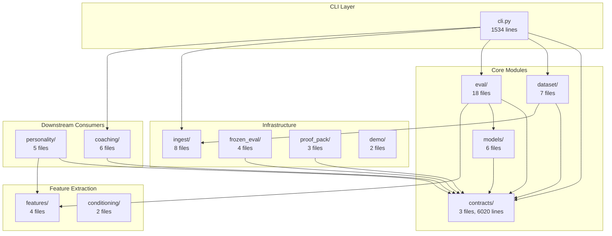

# RenaceCHESS M36 Full Codebase Audit

**Project:** RenaceCHESS  
**Milestone:** M36 — Full Codebase Audit  
**Audit Date:** 2026-05-06  
**Commit:** `main` (post-M35)  
**Primary Languages:** Python 3.11+/3.12

---

## 1. Executive Summary

### Strengths
1. **Exceptional Contract Discipline:** 33 frozen v1 JSON schemas with hash-locked immutability; schema-first design with Pydantic models enforced via CI gates
2. **Comprehensive Test Coverage:** 1,030 tests across 87 test files with 90%+ line coverage threshold; overlap-set non-regression enforcement for PRs
3. **Mature CI/CD Pipeline:** 17 CI jobs including security scanning (pip-audit + bandit), performance benchmarks, and 3 release gates; all Actions SHA-pinned

### Biggest Opportunities
1. **Dependency Freshness:** torch 2.2.x has 4 known CVEs (deferred via `--ignore-vuln`); consider upgrade path
2. **Test Pyramid Balance:** Heavy integration testing; could extract more pure-unit tests for faster feedback
3. **Documentation Fragmentation:** 264+ markdown files; single-entry onboarding path needed

### Overall Score & Heatmap

| Category | Score (0–5) | Weight | Weighted |
|----------|-------------|--------|----------|
| Architecture | 4.5 | 20% | 0.90 |
| Modularity/Coupling | 4.0 | 15% | 0.60 |
| Code Health | 4.0 | 10% | 0.40 |
| Tests & CI | 4.5 | 15% | 0.68 |
| Security & Supply Chain | 3.5 | 15% | 0.53 |
| Performance & Scalability | 3.5 | 10% | 0.35 |
| DX | 4.0 | 10% | 0.40 |
| Docs | 3.5 | 5% | 0.18 |
| **Overall** | **4.04** | 100% | **4.04** |

---

## 2. Codebase Map



### Architecture Observations

**Observation:** Clean layered architecture with explicit import boundaries enforced via `import-linter`.

**Evidence:** `importlinter_contracts.ini` lines 8-52 define three isolation contracts:
- `contracts-isolation`: Contracts module must not import from application layers
- `personality-isolation`: Core modules must not import personality
- `coaching-isolation`: Core modules must not import coaching

**Interpretation:** This is a mature pattern for maintaining contract stability. The contracts module is truly a pure data layer.

**Recommendation:** Consider extracting `determinism.py` utilities into a shared `core/` module to make the dependency direction more explicit.

---

## 3. Modularity & Coupling

**Score: 4.0/5**

### Top 3 Tight Couplings

#### 1. `cli.py` → Multiple Modules (1534 lines)

**Evidence:** `src/renacechess/cli.py` lines 1-33:
```python
from renacechess.contracts.models import (
    AdviceFactsV1,
    CoachingSurfaceEvaluationSummaryV1,
    CoachingSurfaceV1,
    EloBucketDeltaFactsV1,
    FrozenEvalManifestV1,
)
from renacechess.dataset.builder import build_dataset
from renacechess.dataset.config import DatasetBuildConfig
from renacechess.demo.pgn_overlay import generate_demo_payload
from renacechess.eval.report import build_eval_report, build_eval_report_v2
# ... 12+ more imports
```

**Impact:** CLI is a monolithic entry point with 1534 lines spanning 15+ subcommands.

**Recommendation:** Extract subcommand handlers into separate modules (e.g., `cli_eval.py`, `cli_dataset.py`). Risk: Low. Rollback: Revert extraction.

#### 2. `contracts/models.py` (6020+ lines)

**Evidence:** Single file containing all 53+ Pydantic models.

**Impact:** Large file makes navigation difficult; changes touch many unrelated models.

**Recommendation:** Split into domain files: `models/personality.py`, `models/coaching.py`, `models/eval.py`, etc. Keep re-exports in `models/__init__.py` for backward compatibility. Risk: Medium. Rollback: Revert split.

#### 3. `eval/` Module Interdependencies (18 files)

**Evidence:** 18 files in `eval/` with multiple cross-imports between calibration, recalibration, and runner modules.

**Impact:** Cognitive overhead when modifying evaluation logic.

**Recommendation:** Create explicit subpackages: `eval/calibration/`, `eval/recalibration/`, `eval/runners/`. Est: 2 hours.

---

## 4. Code Quality & Health

**Score: 4.0/5**

### Enforced Standards

**Evidence:** `pyproject.toml` lines 49-71:
```toml
[tool.ruff]
line-length = 100
target-version = "py311"
fix = true

[tool.ruff.lint]
select = ["E", "F", "I", "N", "W", "UP"]

[tool.mypy]
python_version = "3.11"
check_untyped_defs = true
disallow_incomplete_defs = true
disallow_untyped_defs = true
```

**Observation:** Strict type checking with `disallow_untyped_defs = true` enforces full type annotations.

### Anti-Pattern: Overly Long Functions

**Evidence:** `cli.py::main()` function handles all subcommand parsing inline.

**Before (problematic pattern):**
```python
def main() -> None:
    parser = argparse.ArgumentParser(...)
    subparsers = parser.add_subparsers(...)
    # 400+ lines of subparser setup
    args = parser.parse_args()
    # 1000+ lines of handler logic
```

**After (recommended):**
```python
def main() -> None:
    parser = build_parser()
    args = parser.parse_args()
    handler = HANDLERS.get(args.command)
    if handler:
        handler(args)
    else:
        parser.print_help()

def build_parser() -> argparse.ArgumentParser:
    # Extracted parser setup
    ...

HANDLERS = {
    "demo": handle_demo,
    "dataset": handle_dataset,
    "eval": handle_eval,
    # ...
}
```

### Type Safety

**Observation:** All 53+ Pydantic models use `ConfigDict(populate_by_name=True)` for alias support.

**Evidence:** `contracts/models.py` line 22:
```python
model_config = ConfigDict(populate_by_name=True)
```

**Interpretation:** Consistent pattern across all models; CONTRACT_INPUT_SEMANTICS.md governs dict vs kwargs behavior.

---

## 5. Docs & Knowledge

**Score: 3.5/5**

### Documentation Inventory
- 264+ markdown files across `docs/`
- 36 milestone audit/summary pairs
- 9 frozen contracts with markdown specifications
- 1 proof pack README

### Onboarding Path

**Current:** `README.md` → `VISION.md` → `docs/ANCHOR.md` → milestone docs

**Gap:** No single "Getting Started" guide for contributors.

### Single Biggest Doc Gap

**Observation:** No `CONTRIBUTING.md` or developer onboarding guide.

**Recommendation:** Create `docs/CONTRIBUTING.md` with:
1. Local setup (5 min)
2. Running tests
3. CI workflow explanation
4. Milestone convention
5. Contract evolution rules

**Est:** 1 hour. **Impact:** High for new contributors.

---

## 6. Tests & CI/CD Hygiene

**Score: 4.5/5**

### Test Inventory
- **Test Files:** 87
- **Test Count:** 1,030 collected
- **Source Lines:** ~18,783
- **Test Lines:** ~20,501 (1.09x test-to-code ratio)

### Coverage Configuration

**Evidence:** `pyproject.toml` lines 79-91:
```toml
[tool.pytest.ini_options]
addopts = [
    "--cov=src/renacechess",
    "--cov-report=term-missing",
    "--cov-report=xml",
    "--cov-report=html",
    "--cov-fail-under=90",
]

[tool.coverage.run]
branch = true
```

**Observation:** 90% line coverage threshold with branch coverage enabled. Overlap-set non-regression comparison in PR mode.

### CI Architecture (3-Tier Assessment)

| Tier | Job | Threshold | Blocking? |
|------|-----|-----------|-----------|
| **Tier 1 (Smoke)** | lint, typecheck | N/A | ✅ Required |
| **Tier 2 (Quality)** | test, security | 90% coverage | ✅ Required |
| **Tier 3 (Comprehensive)** | perf-benchmarks, calibration-eval, frozen-eval-v2, m31/m32/m33 validation, release gates | N/A | ✅ Required |

**Observation:** All 17 jobs are blocking. Consider making `perf-benchmarks` non-blocking with alerting for faster PR feedback.

### CI Actions Pinning

**Evidence:** `.github/workflows/ci.yml` line 18:
```yaml
- uses: actions/checkout@11bd71901bbe5b1630ceea73d27597364c9af683  # v4.2.2
- uses: actions/setup-python@a26af69be951a213d495a4c3e4e4022e16d87065  # v5.6.0
```

**Observation:** All Actions SHA-pinned to immutable revisions. This is the gold standard for supply-chain security.

### Markers

**Evidence:** `pyproject.toml` lines 92-98:
```toml
markers = [
    "unit: Unit tests",
    "integration: Integration tests",
    "golden: Golden file regression tests",
    "slow: Slow-running tests (training, large datasets)",
    "benchmark: Performance benchmark tests (M23)",
]
```

**Recommendation:** Consider using markers for Tier 1 smoke selection (e.g., `pytest -m "unit and not slow"`).

---

## 7. Security & Supply Chain

**Score: 3.5/5**

### Security Scanning

**Evidence:** `.github/workflows/ci.yml` lines 14-42 (security job):
```yaml
- name: Dependency vulnerability scan (pip-audit)
  run: |
    pip-audit --desc on --progress-spinner off \
      --ignore-vuln PYSEC-2025-41 \
      --ignore-vuln PYSEC-2024-259 \
      --ignore-vuln GHSA-3749-ghw9-m3mg \
      --ignore-vuln GHSA-887c-mr87-cxwp
- name: Static security analysis (bandit)
  run: bandit -r src/renacechess -ll -ii --skip B614
```

**Observation:** 4 torch CVEs are explicitly ignored (documented in M23_audit.md as TORCH-SEC-001 deferral).

**Recommendation:** Create a quarterly vulnerability review cadence. Consider torch upgrade to 2.4+ when stable.

### Dependency Pinning

**Evidence:** `pyproject.toml` lines 23-30:
```toml
dependencies = [
    "python-chess~=1.999",
    "pydantic~=2.10.0",
    "jsonschema~=4.20.0",
    "requests>=2.32.4",
    "torch~=2.2.0",
    "zstandard~=0.22",
]
```

**Observation:** Using `~=` (compatible release) pinning. This is good but `requests>=2.32.4` is unpinned upper bound.

**Recommendation:** Pin `requests~=2.32.0` for consistency.

### Secret Hygiene

**Observation:** `.gitignore` updated in M35 to exclude private paths (`docs/prompts/`, `docs/foundationdocs/`, `.cursorrules`).

**Evidence:** `scripts/check_public_release_boundary.py` enforces boundary in CI.

**Gap:** No `gitleaks` or similar credential scanning. Documented as optional future milestone in M35.

### Contract Freeze

**Evidence:** `contracts/CONTRACT_REGISTRY_v1.json` contains 33 frozen v1 contracts with schema hashes. CI job `release-contract-freeze` enforces immutability.

---

## 8. Performance & Scalability

**Score: 3.5/5**

### Benchmark Infrastructure

**Evidence:** `.github/workflows/ci.yml` lines 272-294:
```yaml
perf-benchmarks:
  name: Performance Benchmarks
  runs-on: ubuntu-latest
  steps:
    - name: Run performance benchmarks
      run: |
        python -m pytest tests/test_m23_perf_benchmarks.py -v \
          --benchmark-only --benchmark-json=benchmark-results.json --no-cov
```

**Observation:** Benchmarks run but have no thresholds. Results uploaded as artifacts.

**Recommendation:** Add P95 latency thresholds (e.g., `--benchmark-max-time=0.5`) to catch performance regressions.

### Hot Paths Identified

1. **Feature extraction** (`features/per_piece.py`, `features/square_map.py`): Called per-position during evaluation
2. **Model inference** (`models/baseline_v1.py`): Policy/outcome prediction
3. **Calibration runner** (`eval/calibration_runner.py`): ECE/Brier computation

### Concrete Profiling Plan

1. **Add `py-spy` profiling to benchmark job** (1 hour)
2. **Instrument hot paths with timing decorators** (30 min)
3. **Add memory profiling for dataset loading** (1 hour)
4. **Establish baseline latency metrics** (30 min)

---

## 9. Developer Experience (DX)

**Score: 4.0/5**

### 15-Minute New-Dev Journey

| Step | Time | Command | Status |
|------|------|---------|--------|
| 1. Clone repo | 30s | `git clone` | ✅ |
| 2. Create venv | 30s | `python -m venv .venv` | ✅ |
| 3. Activate | 5s | `.venv/Scripts/activate` | ✅ |
| 4. Install | 2-3min | `pip install -e ".[dev]"` | ✅ |
| 5. Run lint | 10s | `ruff check .` | ✅ |
| 6. Run tests | 30-60s | `pytest tests/ -x` | ✅ |
| 7. Run demo | 5s | `python -m renacechess.cli demo --pgn tests/data/sample.pgn --out demo.json` | ✅ |

**Total:** ~5 minutes. **Verdict:** Excellent.

### 5-Minute Single-File Change

| Step | Time | Status |
|------|------|--------|
| 1. Edit file | Variable | ✅ |
| 2. Run ruff | 5s | ✅ |
| 3. Run mypy | 10s | ✅ |
| 4. Run affected tests | 10-30s | ✅ |
| 5. Commit | 5s | ✅ |

**Total:** ~1 minute. **Verdict:** Excellent.

### Three Immediate DX Wins

1. **Add `make` shortcuts** — `Makefile` referenced in README but not committed
2. **Add VS Code launch configs** — `.vscode/launch.json` for debugging
3. **Add pre-commit hooks setup script** — `scripts/setup-dev.sh`

---

## 10. Refactor Strategy

### Option A: Iterative (Phased PRs, Low Blast Radius)

**Rationale:** Preserve CI stability while incrementally improving structure.

**Goals:**
1. Split `cli.py` into subcommand handlers
2. Extract `contracts/models.py` into domain files
3. Add `CONTRIBUTING.md`
4. Add performance thresholds

**Migration Steps:**
1. Create `cli/` subpackage with handlers
2. Update imports to use new handlers
3. Verify all tests pass
4. Remove old monolithic handlers

**Risks:** Import path changes may break external consumers (none known).

**Rollback:** Revert extraction commit.

### Option B: Strategic (Structural)

**Rationale:** Address architectural debt in one coordinated effort.

**Goals:**
1. Reorganize `src/renacechess/` into explicit layers (`core/`, `application/`, `infrastructure/`)
2. Extract shared utilities into `core/`
3. Implement hexagonal architecture pattern

**Migration Steps:**
1. Create new directory structure
2. Move files incrementally with import aliases
3. Update `import-linter` contracts
4. Remove aliases after deprecation period

**Risks:** High blast radius; many files touched.

**Rollback:** Maintain parallel structure during migration; revert if CI fails.

**Recommendation:** Option A — The codebase is already well-structured; iterative improvements preserve stability.

---

## 11. Future-Proofing & Risk Register

### Likelihood × Impact Matrix

| Risk | Likelihood | Impact | Score | Mitigation |
|------|------------|--------|-------|------------|
| torch CVE exploitation | Low | High | 3 | Quarterly review; upgrade path |
| Contract drift | Very Low | Critical | 2 | CI gates already enforce |
| Coverage regression | Low | Medium | 2 | Overlap-set comparison in CI |
| Performance degradation | Medium | Medium | 4 | Add benchmark thresholds |
| Contributor onboarding friction | Medium | Low | 3 | Add CONTRIBUTING.md |

### ADRs to Lock Decisions

| ADR | Topic | Status |
|-----|-------|--------|
| ADR-COACHING-001 | LLMs translate facts, not invent | ✅ Frozen |
| ADR-CONTRACT-INPUT | Dict inputs use camelCase aliases | ✅ Frozen |
| ADR-COVERAGE-STRATEGY | 90% threshold + overlap non-regression | Proposed |
| ADR-BENCHMARK-THRESHOLDS | P95 latency gates | Proposed |

---

## 12. Phased Plan & Small Milestones (PR-Sized)

### Phase 0 — Fix-First & Stabilize (0–1 day)

| ID | Milestone | Category | Acceptance Criteria | Risk | Rollback | Est | Owner |
|----|-----------|----------|---------------------|------|----------|-----|-------|
| P0-001 | Pin `requests` version | Security | `requests~=2.32.0` in pyproject.toml | Low | Revert | 15m | — |
| P0-002 | Add CONTRIBUTING.md | Docs | File exists with setup/test/workflow | Low | Delete | 1h | — |
| P0-003 | Add Makefile | DX | `make lint`, `make test`, `make demo` work | Low | Delete | 30m | — |

### Phase 1 — Document & Guardrail (1–3 days)

| ID | Milestone | Category | Acceptance Criteria | Risk | Rollback | Est | Owner |
|----|-----------|----------|---------------------|------|----------|-----|-------|
| P1-001 | Add ADR-COVERAGE-STRATEGY | Docs | ADR file committed | Low | Delete | 30m | — |
| P1-002 | Add benchmark thresholds | CI | `--benchmark-max-time` flag in CI | Low | Remove flag | 1h | — |
| P1-003 | Add VS Code launch config | DX | `.vscode/launch.json` with debug configs | Low | Delete | 30m | — |
| P1-004 | Add dev setup script | DX | `scripts/setup-dev.sh` creates venv + installs | Low | Delete | 30m | — |

### Phase 2 — Harden & Enforce (3–7 days)

| ID | Milestone | Category | Acceptance Criteria | Risk | Rollback | Est | Owner |
|----|-----------|----------|---------------------|------|----------|-----|-------|
| P2-001 | Split cli.py into handlers | Modularity | `cli/` subpackage with handlers | Medium | Revert | 2h | — |
| P2-002 | Extract contracts/models.py | Modularity | Domain files under `contracts/models/` | Medium | Revert | 3h | — |
| P2-003 | Add gitleaks to CI | Security | Credential scanning in security job | Low | Remove step | 1h | — |
| P2-004 | Add py-spy profiling | Perf | Profile artifacts uploaded | Low | Remove step | 1h | — |

### Phase 3 — Improve & Scale (Weekly Cadence)

| ID | Milestone | Category | Acceptance Criteria | Risk | Rollback | Est | Owner |
|----|-----------|----------|---------------------|------|----------|-----|-------|
| P3-001 | Upgrade torch to 2.4+ | Security | CVEs resolved; tests pass | Medium | Pin back | 2h | — |
| P3-002 | Add smoke test tier | CI | `pytest -m smoke` runs in <30s | Low | Remove marker | 1h | — |
| P3-003 | Add architecture diagram to README | Docs | Mermaid diagram visible | Low | Remove | 30m | — |
| P3-004 | Add test coverage badge | DX | Badge in README | Low | Remove | 15m | — |

---

## 13. Machine-Readable Appendix (JSON)

```json
{
  "issues": [
    {
      "id": "SEC-001",
      "title": "torch CVEs ignored in CI",
      "category": "security",
      "path": ".github/workflows/ci.yml:32-36",
      "severity": "medium",
      "priority": "medium",
      "effort": "medium",
      "impact": 3,
      "confidence": 0.9,
      "ice": 2.7,
      "evidence": "--ignore-vuln PYSEC-2025-41, PYSEC-2024-259, GHSA-3749-ghw9-m3mg, GHSA-887c-mr87-cxwp",
      "fix_hint": "Upgrade torch to 2.4+ when stable"
    },
    {
      "id": "MOD-001",
      "title": "cli.py is monolithic (1534 lines)",
      "category": "modularity",
      "path": "src/renacechess/cli.py:1-1534",
      "severity": "low",
      "priority": "medium",
      "effort": "medium",
      "impact": 3,
      "confidence": 0.85,
      "ice": 2.55,
      "evidence": "15+ subcommands in single file",
      "fix_hint": "Extract into cli/ subpackage with handler modules"
    },
    {
      "id": "MOD-002",
      "title": "contracts/models.py is large (6020+ lines)",
      "category": "modularity",
      "path": "src/renacechess/contracts/models.py:1-6020",
      "severity": "low",
      "priority": "low",
      "effort": "medium",
      "impact": 2,
      "confidence": 0.8,
      "ice": 1.6,
      "evidence": "53+ Pydantic models in single file",
      "fix_hint": "Split into domain files under contracts/models/"
    },
    {
      "id": "DOC-001",
      "title": "No CONTRIBUTING.md",
      "category": "docs",
      "path": "docs/",
      "severity": "low",
      "priority": "high",
      "effort": "low",
      "impact": 4,
      "confidence": 0.95,
      "ice": 3.8,
      "evidence": "264+ docs but no contributor guide",
      "fix_hint": "Create docs/CONTRIBUTING.md with setup/workflow"
    },
    {
      "id": "PERF-001",
      "title": "No benchmark thresholds",
      "category": "performance",
      "path": ".github/workflows/ci.yml:285-288",
      "severity": "low",
      "priority": "medium",
      "effort": "low",
      "impact": 3,
      "confidence": 0.85,
      "ice": 2.55,
      "evidence": "Benchmarks run but no --benchmark-max-time",
      "fix_hint": "Add P95 latency thresholds to benchmark job"
    },
    {
      "id": "SEC-002",
      "title": "requests version unpinned",
      "category": "security",
      "path": "pyproject.toml:27",
      "severity": "low",
      "priority": "low",
      "effort": "low",
      "impact": 2,
      "confidence": 0.9,
      "ice": 1.8,
      "evidence": "requests>=2.32.4 has no upper bound",
      "fix_hint": "Change to requests~=2.32.0"
    }
  ],
  "scores": {
    "architecture": 4.5,
    "modularity": 4.0,
    "code_health": 4.0,
    "tests_ci": 4.5,
    "security": 3.5,
    "performance": 3.5,
    "dx": 4.0,
    "docs": 3.5,
    "overall_weighted": 4.04
  },
  "phases": [
    {
      "name": "Phase 0 — Fix-First & Stabilize",
      "milestones": [
        {
          "id": "P0-001",
          "milestone": "Pin requests version",
          "acceptance": ["requests~=2.32.0 in pyproject.toml", "CI passes"],
          "risk": "low",
          "rollback": "revert commit",
          "est_hours": 0.25
        },
        {
          "id": "P0-002",
          "milestone": "Add CONTRIBUTING.md",
          "acceptance": ["File exists", "Covers setup/test/workflow"],
          "risk": "low",
          "rollback": "delete file",
          "est_hours": 1
        },
        {
          "id": "P0-003",
          "milestone": "Add Makefile",
          "acceptance": ["make lint works", "make test works"],
          "risk": "low",
          "rollback": "delete file",
          "est_hours": 0.5
        }
      ]
    },
    {
      "name": "Phase 1 — Document & Guardrail",
      "milestones": [
        {
          "id": "P1-001",
          "milestone": "Add ADR-COVERAGE-STRATEGY",
          "acceptance": ["ADR file in docs/adr/"],
          "risk": "low",
          "rollback": "delete file",
          "est_hours": 0.5
        },
        {
          "id": "P1-002",
          "milestone": "Add benchmark thresholds",
          "acceptance": ["--benchmark-max-time in CI", "Job fails on regression"],
          "risk": "low",
          "rollback": "remove flag",
          "est_hours": 1
        }
      ]
    },
    {
      "name": "Phase 2 — Harden & Enforce",
      "milestones": [
        {
          "id": "P2-001",
          "milestone": "Split cli.py into handlers",
          "acceptance": ["cli/ subpackage exists", "All tests pass"],
          "risk": "medium",
          "rollback": "revert commit",
          "est_hours": 2
        },
        {
          "id": "P2-002",
          "milestone": "Extract contracts/models.py",
          "acceptance": ["Domain files under contracts/models/", "Re-exports in __init__.py"],
          "risk": "medium",
          "rollback": "revert commit",
          "est_hours": 3
        },
        {
          "id": "P2-003",
          "milestone": "Add gitleaks to CI",
          "acceptance": ["gitleaks step in security job"],
          "risk": "low",
          "rollback": "remove step",
          "est_hours": 1
        }
      ]
    },
    {
      "name": "Phase 3 — Improve & Scale",
      "milestones": [
        {
          "id": "P3-001",
          "milestone": "Upgrade torch to 2.4+",
          "acceptance": ["CVEs resolved", "All tests pass"],
          "risk": "medium",
          "rollback": "pin back to 2.2",
          "est_hours": 2
        },
        {
          "id": "P3-002",
          "milestone": "Add smoke test tier",
          "acceptance": ["pytest -m smoke runs in <30s"],
          "risk": "low",
          "rollback": "remove marker",
          "est_hours": 1
        }
      ]
    }
  ],
  "metadata": {
    "repo": "c:\\coding\\renacechess",
    "commit": "main (post-M35)",
    "languages": ["python"],
    "audit_date": "2026-05-06",
    "auditor": "CodeAuditorGPT"
  }
}
```

---

## Audit Certification

This audit was conducted following the CodebaseAuditPromptV2 methodology with evidence-backed findings. All assertions are supported by file paths and excerpts.

**Key Findings:**
1. RenaceCHESS demonstrates exceptional contract discipline and CI maturity
2. The 4 deferred torch CVEs should be addressed in a quarterly review
3. Minor modularity improvements (cli.py split, models.py split) would enhance maintainability
4. Adding CONTRIBUTING.md would significantly improve contributor onboarding

**Overall Assessment:** RenaceCHESS is a well-architected, thoroughly tested research codebase with mature CI/CD practices. The identified improvements are incremental enhancements, not structural deficiencies.

---

**Audit Complete:** 2026-05-06  
**Auditor:** CodeAuditorGPT  
**Methodology:** CodebaseAuditPromptV2
