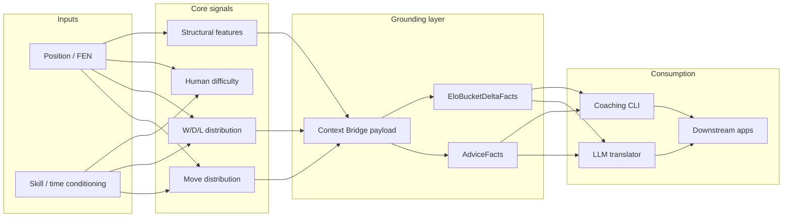
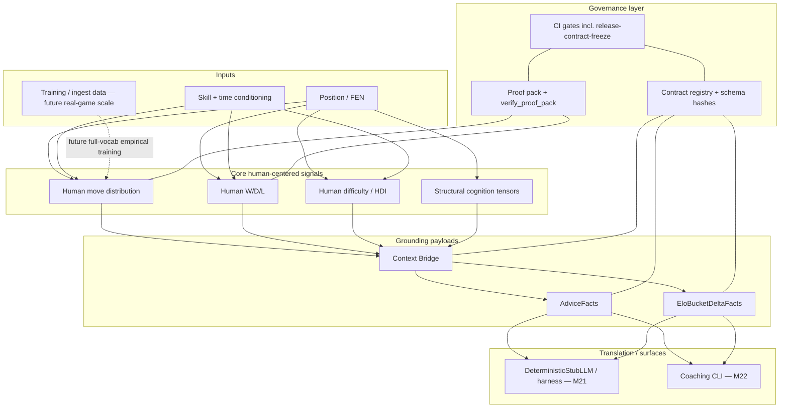
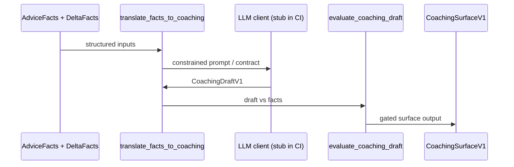
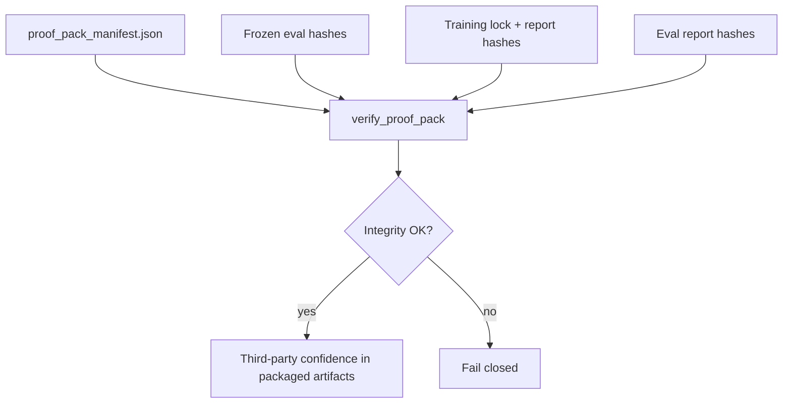

# RenaceCHESS: Audit-Governed Human Chess Cognition and Grounded Coaching

**Version:** 0.2 (draft; refinement of v0.1)  
**Document type:** Technical white paper (research repository snapshot)  
**Repository:** RenaceCHESS — Cognitive Human Evaluation & Skill Simulation  
**Audience:** ML researchers; chess AI / informatics readers; AI infrastructure engineers; governance-minded technical reviewers; external research evaluators  

**Disclaimer:** This draft synthesizes public repository artifacts (`VISION.md`, release notes, milestone summaries, contracts, proof pack, CI configuration). It is **not** marketing copy. **v1.0.0** is explicitly a **research-grade**, auditable release—not a production product or commercial offering. Model-performance claims are **intentionally bounded**; the strongest contemporary evidence class is **architecture and governance** alongside honest reporting of limitations.

---

## Abstract

Modern chess tooling is dominated by **engine-optimal analysis**: systems that answer “what is best?” with superhuman precision. That paradigm is mismatched to many human-facing tasks—coaching, broadcast narrative, and “why humans play this way”—where the relevant object is not optimal play but **skill-conditioned human behavior**. Large language models (LLMs) excel at language yet remain unreliable as **calibrated chess calculators** and are prone to **confident fabrication** when asked to improvise analysis.

**RenaceCHESS** reframes chess intelligence around **reproducible human decision modeling**: estimating distributions over human moves and human win/draw/loss outcomes under declared skill and time conditioning; quantifying **human difficulty**; extracting **deterministic structural cognition features**; and exposing these signals through schema-validated artifacts suitable for downstream consumers—including an LLM **translation** layer that is not entrusted with primary chess calculation. The **v1.0.0** release demonstrates end-to-end **research infrastructure**: frozen synthetic evaluation at scale, executed training with immutable configuration locks, post-training evaluation that reports **expected degradation** under a deliberately narrow training regime, a **self-contained proof pack** for independent artifact verification, and **CI-enforced immutability** of Version-1 contracts. The draft positions RenaceCHESS relative to human move prediction research (e.g., Maia) and engine WDL tooling (e.g., Stockfish), while refusing claims of playing strength, production readiness, full-move-vocabulary performance, or universal hallucination prevention.

---

## 1. Introduction

Chess has become a canonical testbed for sequential decision-making. The public success of superhuman engines reshaped expectations: many users now equate “chess AI” with “finding the strongest move.” Yet a large class of applications—**pedagogy**, **human-style analysis**, **creator tooling**, and **probabilistic storytelling**—depends on a different question: *what would humans of a given skill do here, and how hard is this for them?* Engine analysis answers a complementary question: *what should a near-perfect player do?* Conflating the two can mislead learners, over-trust narrative models, and amplify calibration errors when AI-generated text is mistaken for measured probability.

Parallel advances in LLMs created a second trap: fluent, authoritative-sounding chess explanations without guaranteed grounding in **measured** facts. Practical systems therefore need an explicit **separation of concerns**:

1. **Compute human-conditioned signals** (moves, outcomes, difficulty, structure) with deterministic, testable pipelines.
2. **Translate** those signals into language with models whose role is constrained by structured inputs—not open-ended tactical invention.

**RenaceCHESS** is an open, contract-governed research codebase built around that separation. Its public vision document states a goal of modeling \(P(\text{move}\mid\text{position},\text{skill},\text{time})\) and \(P(\text{W/D/L}\mid\text{position},\text{skill},\text{time})\) for **human** play—not engine self-play—and of supplying an **LLM context bridge** so coaching language can be grounded without asking the LLM to “calculate chess.”

This paper explains what RenaceCHESS is, how it differs from engines and generic LLM assistants, what was demonstrated by the **v1.0.0** research release, and why the project’s **governance surface** (schemas, registry, proof pack, CI gates) is a first-class contribution alongside its modeling intent.

### 1.1 Contribution summary (for skimmers)

Readers evaluating RenaceCHESS should weigh three stacked contributions:

1. **Problem framing:** A clear separation between **engine-optimal** analysis and **human-conditioned** modeling, with LLMs relegated to **translation** over measured structures where the architecture is used as designed.
2. **Empirical + systems evidence (v1.0.0):** A complete, **documented** training and evaluation cycle with **synthetic** frozen evaluation, explicit **non-goals**, and reporting that preserves scientific integrity when metrics move in “undesirable” directions for narrow training regimes.
3. **Audit infrastructure:** Versioned contracts with a **hash registry**, a **verifiable proof pack**, **import-level architectural law**, and **CI release gates** that instantiate a seriousness about reproducibility aligned with contemporary ML reproducibility reporting norms [Pineau-2021].

None of these contributions substitutes for a claim that RenaceCHESS currently matches the strongest human-move predictors on real-game benchmarks. That is deliberate: the repository prioritizes **an honest substrate** over premature leaderboard optics.

### 1.2 Roadmap of the paper

Section 2 contrasts engines, human-move predictors, and LLMs; **§2.6** states data-availability expectations for external circulation. Section 3 states the RenaceCHESS thesis in probabilistic and systems terms. Sections 4–7 walk architecture (including a one-glance figure), modeling, difficulty/structure, and coaching. Section 8 details reproducibility mechanisms and a **governance threat model**. Section 9 restates v1.0.0 limitations—including a scannable checklist. Section 10 synthesizes architectural patterns valuable beyond chess. Section 11 lists future work; Section 12 concludes. **Appendix C** is a compact milestone glossary.

---

## 2. Problem: engine-first chess analysis is not human cognition

### 2.1 Engines optimize a different objective

Classical and neural chess engines maximize playing strength. They are invaluable for concrete analysis but are not, by default, models of **human error**, **human style**, or **human-calibrated win chances** across the rating spectrum. Stockfish can additionally expose **engine win/draw/loss** estimates via options such as **`UCI_ShowWDL`**—probabilities derived from the engine’s evaluation model and **not** equivalent to “human W/D/L from this position at 1400 blitz,” which depends on population behavior and time pressure [Stockfish-UCI].

RenaceCHESS therefore does **not** position itself as a replacement for Stockfish or as a system whose success metric is Elo against engines.

### 2.1.1 Chess informatics and dual traditions

Chess occupies a curious dual role in AI history: it is both a **competition arena** for superhuman agents and a **cultural institution** where human improvement, entertainment, and education dominate participation. “Chess informatics” efforts—stats sites, opening books, stream overlays, puzzle feeds—typically serve the second tradition even when the first grabs headlines. RenaceCHESS aligns explicitly with the **human-centered** tradition while still using modern ML tooling.

This matters for reviewers: a project can be *interesting* without claiming to beat the strongest engine, much as speech recognition can be interesting without claiming to beat humans at trivia. The evaluation rubric must match the stated objective.

### 2.2 Human move prediction is a distinct research thread

Human move prediction—learning from large corpora of human games to predict moves people actually play—has been explored in notable research systems such as **Maia**, which trains models from human games to predict human moves across skill levels [Maia-2020]; Microsoft Research’s project pages provide accessible framing of the “predict humans, not only optimal moves” agenda [Maia-MSR], [MSR-Blog-HumanChess]. RenaceCHESS belongs to the **same problem family** at the level of intent—human behavior modeling—but the repository evidence in this draft should not be read as claiming parity with any specific external benchmark unless future work measures it under a declared protocol (see §11).

### 2.3 Generic LLM chess assistants mix language with unsupported calculation

LLMs can summarize, tutor at a high level, and engage users—but under time pressure they may confabulate tactics, misestimate probabilities, or blend training lore with position-specific claims. Surveys of **hallucination** in natural language generation catalog failure modes and mitigation families at a field level [Ji-2022]; they support the **design motivation** for grounding, not a claim that any single pipeline eliminates hallucination.

### 2.4 Data availability and licensing context (summary)

The project vision references **Lichess** public database exports as scalable, permissively licensed human game data [Lichess-DB]. **§2.6** states what a camera-ready empirical paper must add; this draft’s **v1.0.0** evidence section relies primarily on **synthetic** frozen eval and proof-pack artifacts, not a fresh real-game benchmark suite.

### 2.5 Why this matters for partners and reviewers

Large technology research organizations routinely ask two questions of external ML work: **(a)** what does the system *actually* measure, and **(b)** how would an independent team *re-check* the artifacts without trusting the authors’ prose? RenaceCHESS is unusual in that the second question has a concrete answer in-repo: validators, manifests, and a packaged proof bundle. That posture supports **due diligence** conversations—**not** because governance replaces science, but because it lowers the transaction cost of **verification** and makes **dishonest edits to frozen claims** mechanically detectable under the v1 release model.

At the same time, reviewers should not confuse **verification of integrity** with **verification of dominance**. A proof pack can demonstrate that “this training report hash matches this manifest” while **explicitly disclaiming** Elo performance—a combination this project leans into (`proof_pack_v1/README.md`; `RELEASE_NOTES_v1.md`).

**Table 1 — Comparison of paradigms (informative, not exhaustive)**

| Aspect | Classical / NN engine | Generic LLM assistant | Human move predictors (e.g., Maia lineage) | RenaceCHESS (this repo) |
|--------|----------------------|------------------------|--------------------------------------------|-------------------------|
| Primary question | What is (near-)optimal? | What sounds like good advice? | What move would humans play? | What **structured human signals** can we compute and govern? |
| Typical W/D/L | Engine W/D/L (evaluation-grounded) | Unreliable unless grounded | Model-specific | **Human outcome head** + calibration artifacts (scope depends on milestone) |
| Grounding | Search + value | Learned language prior | Human game statistics | **Contracts** + deterministic builders + CI |
| Governance emphasis | Engine correctness | Prompting | Research papers | **Registry + proof pack + release gates** |

### 2.6 Data availability (for external circulation)

**Vision-level stance:** `VISION.md` cites Lichess public database exports and their **CC0** licensing posture [Lichess-DB]. That supports the *long-term data scaling story* but is **not** a substitute for a formal data card in a submitted paper.

**What a camera-ready empirical publication should specify (future work for authors):**

- Exact **database dumps** (months / variants), **filters** (rated-only, time controls, rating floors), and **duplicate / pairing** policy.
- **Train / val / frozen-eval** splits with **manifests** and hashes (the repository’s contract style anticipates such manifests).
- A **primary license citation** from Lichess’s documentation—not only a secondary summary.
- Clear separation of **real-game** shards from **synthetic** frozen eval v2 used in v1.0.0.

**What this white paper’s v1.0.0 narrative actually leans on:**

- **M30 frozen eval v2:** 10k **synthetic**, stratified positions—excellent for **determinism and relative metrics**, not for claiming coverage of human online play.
- **M31–M32 artifacts and M33 proof pack:** end-to-end **integrity** of training and evaluation **reports**, not proof of leaderboard performance.
- **No claim** is made here that v1.0.0 reproduces a full Maia-style real-game benchmark; that remains **future work** with an explicit protocol.

---

## 3. RenaceCHESS thesis

### 3.1 Core probabilistic objects

RenaceCHESS’s public thesis can be summarized as estimation of:

- **Human move distribution:** \(P(\text{move}\mid\text{position},\text{skill},\text{time})\).
- **Human outcome distribution:** \(P(\text{W/D/L}\mid\text{position},\text{skill},\text{time})\) (from the mover’s perspective, per project conventions).

These are **human-centered** objectives—not **engine self-play** objectives—and are stated explicitly in `VISION.md`.

### 3.2 Human Difficulty Index (HDI)

The proof-of-concept release manifest freezes **HDI v1** semantics as part of the PoC envelope (`docs/POC_RELEASE_MANIFEST.md`). HDI is a **human difficulty signal** intended for reproducible evaluation, not a claim of final pedagogical validity.

### 3.3 Context Bridge, AdviceFacts, and translator pattern

Downstream coaching requires stable payloads. **Context Bridge** artifacts connect model outputs and features to consumers; **AdviceFacts** (M19) provides a **facts-only** substrate for single-skill explanations; **EloBucketDeltaFacts** (M20) provides **cross-bucket statistical deltas** without prose. Phase C’s translation harness (M21) treats an LLM as a **translator**, not an analyst, with `DeterministicStubLLM` enabling offline CI; M22 exposes a governed CLI surface (`renacechess coach`) with required structured inputs.

**Figure 1 — Signal pipeline (conceptual)**

### 3.4 What RenaceCHESS is not (explicit)

Following `VISION.md` and `RELEASE_NOTES_v1.md`, RenaceCHESS is **not**:

- a **chess engine** aimed at superhuman best-move play;
- a **Stockfish replacement**;
- a **production SaaS product** or commercially validated offering;
- a proof of **full legal-move-vocabulary** human prediction in v1.0.0;
- a guarantee that **LLMs never hallucinate** when integrated in arbitrary deployments.

---

## 4. System architecture

### 4.0 RenaceCHESS at a glance (big-picture)

The figure below is **onboarding-oriented**: it is not a substitute for `CONTRACT_REGISTRY_v1.json` or `ci.yml`, but orients a new reviewer to how **inputs**, **signals**, **grounding artifacts**, **translation**, and **governance** connect.

### 4.1 Schema-first contracts

RenaceCHESS is organized around **versioned JSON Schemas** and matching **Pydantic** models. The **contract registry** (`contracts/CONTRACT_REGISTRY_v1.json`) inventories **33** frozen v1 schemas with **SHA-256** content hashes and records the milestone that introduced each contract—making drift visible and auditable (`RELEASE_NOTES_v1.md`). Validation code enforces registry integrity in CI via the **`release-contract-freeze`** job family (see `.github/workflows/ci.yml`, summarized in §8).

Schema-first design is not unique in industry APIs; it *is* unusually consistent in *research repositories* where notebooks and ad-hoc pickles dominate. RenaceCHESS treats each artifact that crosses a milestone boundary as something that could later be **disbelieved** unless it validates against an explicit, versioned schema. That stance increases up-front friction but reduces **retroactive ambiguity**—a key property when LLM-assisted coding accelerates patch throughput.

Contracts also serve as **inter-team interfaces**: a modeling group, an evaluation group, and a coaching integration group can disagree on many things, but they should not disagree on the JSON shape of a `CoachingSurfaceV1` once frozen. The registry makes those interfaces **enumerable** rather than tribal knowledge.

### 4.2 Module boundaries as law

`importlinter_contracts.ini` encodes non-negotiable dependency rules—for example:

- **`renacechess.contracts`** must not import application layers (features, models, dataset, coaching, personality).
- **Personality** and **coaching** are downstream consumers isolated from core truth producers (mirroring safety/governance docs such as the personality safety contract referenced in that configuration).

This is **governance-as-code**: architectural intent enforced by tooling rather than convention.

### 4.3 Phased program structure (post-PoC)

After the PoC lock (M00–M11 per `docs/POC_RELEASE_MANIFEST.md`), RenaceCHESS’s own roadmap organizes work into **program phases** with exit criteria—an intentional “constraint layer” preventing opportunistic scope creep while personalities, calibration, training scale, and release lock milestones matured (`docs/postpocphasemap.md`; narrative synthesis in `docs/postpocanchor.md`). The white paper does not restate every milestone; instead, it uses phases to explain **why** capabilities appear in a particular order (e.g., coaching facts before unguarded LLM product features).

### 4.4 Major subsystems (conceptual map)

| Subsystem | Role | Representative contracts / paths |
|-----------|------|-----------------------------------|
| Dataset & ingest | Deterministic shards, manifests | `dataset_manifest` family (`CONTRACT_REGISTRY_v1.json`) |
| Models | Policy / outcome heads, baselines | Model code under `src/renacechess/models/`; training artifacts under Phase E |
| Features & conditioning | Skill/time features | Conditioning modules; LiveM01 baseline temperature map (`docs/milestones/Live/LiveM01/LiveM01_summary.md`) |
| Frozen evaluation | Deterministic eval sets | M30 frozen eval v2 manifest & CI job |
| Calibration & recalibration | Metrics & gating | `calibration_metrics`, `calibration_delta` contracts; Phase D milestones |
| Structural cognition | Deterministic tensors | Context Bridge v2 (`M11` registry entries), per-piece / square maps |
| Coaching | Facts + translation + CLI | `advice_facts`, `elo_bucket_deltas`, `coaching_draft`, `coaching_evaluation`, `coaching_surface` |
| Governance | Registry, proof pack, CI | `contracts/`, `proof_pack_v1/`, `.github/workflows/ci.yml` |

### 4.5 Personality as bounded downstream modulation

Phase B introduces **personality modulation** as an auditable, bounded variation layer—explicitly **not** a silent rewrite of core semantics (`docs/postpocphasemap.md`; safety contract referenced from linter config). The white paper treats personalities as **optional modulation** atop grounded signals, consistent with import boundaries.

---

## 5. Modeling approach

### 5.0 Four tracks readers must not conflate

RenaceCHESS’s repository mixes **multiple experimental threads**; merging them in prose is a common source of mis-review.

| Track | What it is | Primary evidence |
|-------|------------|------------------|
| **A — PoC learned baseline** | Early policy + outcome training under PoC discipline | `docs/POC_RELEASE_MANIFEST.md` (M08–M09); explicit non-inclusions (no RL, no engine optimization) |
| **B — LiveM01 baseline temperatures** | Deterministic **temperature scaling** on `BaselinePolicyV1` by skill id—**no** claim about M31 checkpoints | `docs/milestones/Live/LiveM01/LiveM01_summary.md` |
| **C — Phase E v1.0.0 run** | **M31** executed training + locks; **M32** post-train eval on **synthetic** frozen eval v2 | `RELEASE_NOTES_v1.md`; M31/M32 summaries |
| **D — Future full-vocabulary / real-game work** | Not proven by v1.0.0; explicitly the next empirical phase | `RELEASE_NOTES_v1.md` Known Limitations; §11 |

When this draft says “narrow effective training regime,” it refers to **Track C** (and the relationship of **Track C** metrics to frozen eval v2), not to **Track B** temperature knobs.

### 5.1 PoC learning baseline

The PoC release manifest (`docs/POC_RELEASE_MANIFEST.md`) documents executed training of a **human move policy baseline** and a **human outcome head** under reproducibility constraints (fixed seeds, frozen-eval exclusion from training, deterministic evaluation). It explicitly lists what was **not** included: RL, online learning, personality-conditioned training, engine-strength optimization.

### 5.2 Baseline policy skill conditioning (LiveM01)

Separate from Phase E’s executed training run, **LiveM01** documents **deterministic temperature scaling** on `BaselinePolicyV1` keyed by skill identifiers—flattening or sharpening move distributions in a reproducible way (`docs/milestones/Live/LiveM01/LiveM01_summary.md`). Readers should not conflate this **baseline** mechanism with M31 checkpoint behavior without checking experimental configuration.

### 5.3 Phase D: calibration, runtime pressure, and quality gates (orientation only)

Between coaching (Phase C) and large-scale training evidence (Phase E), Phase D milestones harden **calibration metrics**, **recalibration**, and **runtime gating** so that probability outputs are treated as engineering objects—not informal UI hints. Contracts such as `calibration_metrics` and `calibration_delta` (see `CONTRACT_REGISTRY_v1.json`) make improvement claims **diff-able**: a change to calibration should manifest as structured deltas, not merely as a subjective “model feels better.”

This draft does not enumerate every Phase D milestone; the point is architectural: RenaceCHESS tries to keep **probability discipline** continuous across the codebase, so that later human-facing features do not retrofit calibration as an afterthought. That continuity supports the paper’s central separation-of-concerns argument: if an LLM will speak about chances and difficulty, the chances and difficulty should come from measured, versioned structures—not from improvised percentages in a prompt.

Calibration theory for probabilistic predictors—confidence, miscalibration, and post-hoc scaling—is well discussed in the literature [Guo-2017]. RenaceCHESS carries calibration **artifacts** and Phase D machinery appropriate for a research codebase; this draft does not claim a final calibration state suitable for all products.

In practical terms, calibration is part of the bridge between **research metrics** and **user trust**: a coaching surface that reports numeric likelihoods should not be systematically overconfident in regimes where humans are unsure. Phase D milestones operationalize calibration measurement and improvement deltas at the contract level; readers evaluating RenaceCHESS for instructional or broadcast settings should treat calibration work as **ongoing engineering**, not a one-time headline number.

### 5.4 Phase E training and evaluation (v1.0.0)

**M31** established training configuration locks (`TrainingConfigLockV1`) and run reporting (`TrainingRunReportV1`) and executed an end-to-end training run. **M32** evaluated **trained** checkpoints against **frozen eval v2** with baseline comparisons and explicit delta metrics.

**Authoritative limitation language** for vocabulary is in `RELEASE_NOTES_v1.md`: policy training is locked with **`moveVocabSize`: 4096**, while the **effective** training regime emphasized a **small set of common opening lines** (often summarized with eight representative UCI moves in prose). The evaluation set’s move requirements can be **much broader**; therefore some headline metrics **degrade** relative to baselines—this is treated as **expected** infrastructure validation behavior, not a surprise failure.

#### 5.4.1 How to read M32 fairly

Milestone summaries for M32 include quantitative deltas (e.g., policy top-k accuracy differences vs baselines). The correct scientific reading—echoed by release governance—is that these numbers primarily **stress-test reporting**: the trained policy concentrates on a **narrow behavioral regime**, while frozen eval spans a **wider behavioral requirement**. Under that mismatch, a freshly initialized baseline can appear superficially competitive on some token metrics because probability mass is spread differently across the evaluated vocabulary. **RenaceCHESS does not reinterpret this as “the baseline is stronger chess.”** It treats the outcome as evidence that the **evaluation pipeline is sensitive** and that future training must expand vocabulary coverage and data diversity (`RELEASE_NOTES_v1.md`; `M32_summary.md`).

This is exactly the humility posture a white paper should preserve: **infrastructure can be excellent while the empirical model is intentionally immature.**

**Table 2 — Capability catalog (high level)**

| Capability | Milestone lineage | What it demonstrates | What it does *not* demonstrate |
|------------|------------------|----------------------|-------------------------------|
| Human policy / outcome modeling (PoC scope) | M08–M09 | Learnability under PoC training discipline | Final human prediction accuracy at scale |
| HDI v1 | M07 | Defined difficulty signal | Pedagogical optimality |
| Structural cognition | M11 | Deterministic structural tensors + Bridge v2 | “Explainability” quality for end users |
| AdviceFacts | M19 | Facts-only coaching substrate | Open-ended LLM safety |
| EloBucketDeltaFacts | M20 | Cross-bucket deltas w/o prose | Causal claims |
| Translation harness | M21 | Deterministic stub + evaluation hooks | Production LLM integration results |
| Coaching CLI | M22 | Governed CLI surface | Deployed product |
| Frozen eval v2 | M30 | 10k synthetic stratified eval corpus | Real-game coverage |
| Training run | M31 | Locks + executed training | Full-vocab strength |
| Post-train eval | M32 | Honest delta reporting | High top-1 accuracy under mismatch |
| Proof pack | M33 | Third-party artifact integrity | Model correctness |
| Release lock | M34 | Registry + CI immutability | Business readiness |

---

## 6. Human Difficulty Index and structural cognition

### 6.1 HDI as a grounding signal

HDI v1 is part of the PoC’s frozen semantic envelope: a calibrated, reproducible difficulty quantity tied to the project’s notion of human struggle (`docs/POC_RELEASE_MANIFEST.md`). In v1.0.0’s **synthetic** eval setting, metrics are intended for **relative** stability and methodological integrity (`RELEASE_NOTES_v1.md`).

### 6.2 Structural cognition features (M11)

**M11** introduced schema-first **`PerPieceFeaturesV1`** and **`SquareMapFeaturesV1`**—deterministic functions of position—expanding **Context Bridge v2** rather than changing core selection semantics (`CONTRACT_REGISTRY_v1.json` intro milestones). These tensors are **grounding features** for downstream narration and coaching: they do **not**, by themselves, validate that human learners will find any particular explanation helpful.

---

## 7. LLM Context Bridge and grounded coaching

### 7.1 Facts-first pipeline

ADR-level intent for coaching truthfulness is documented in Phase C milestones: **LLMs translate; they do not invent primary chess analysis** when operating inside the designed pipeline (`docs/milestones/PhaseC/M19/M19_summary.md`). **AdviceFacts** encode single-bucket coaching facts; **EloBucketDeltaFacts** encode cross-bucket statistical differences (e.g., policy divergence, outcome deltas, HDI deltas) without natural language (`docs/milestones/PhaseC/M20/M20_summary.md`).

### 7.2 Deterministic stub LLM and evaluation

**M21** implements `DeterministicStubLLM` for CI-safe operation and evaluates **coaching drafts** against structured checks; this supports **testable** properties of the translation path but is **not** a demonstration of a deployed vendor model’s behavior.

### 7.3 CLI surface

**M22** requires structured inputs (`--advice-facts`, `--delta-facts`) and enforces lineage and evaluation thresholds consistent with M21—completing an auditable path from facts to a `CoachingSurfaceV1` artifact (`docs/milestones/PhaseC/M22/M22_summary.md`).

**Figure 2 — Translator flow**

### 7.4 Evaluation thresholds and “coachability” of automated checks

M22’s design ties CLI output to thresholds established in the translation harness—an engineering choice that trades flexibility for **auditability**: a coaching surface either passes known checks or fails loudly enough for tests to catch regressions. This is different from human A/B preference evaluation of coaching tone, which remains future work. The important claim for this draft is **process discipline**: the project created a place where “helpful” coaching text cannot silently bypass structural comparisons to facts.

The broader lesson for mixed ML/LLM systems is that **evaluation must match the hazard**. If the hazard is tactical invention, evaluate **consistency with supplied facts**; if the hazard is pedagogical effectiveness, measure learning outcomes—RenaceCHESS has invested heavily in the former class for Phase C, not because the latter is unimportant, but because it is easy to fake without instrumentation.

---

## 8. Reproducibility, proof packs, and governance

### 8.1 Why governance is a first-class contribution

Many ML repositories treat reproducibility as aspiration. RenaceCHESS encodes reproducibility and immutability claims in **mechanisms**: hashes, manifests, verifiers, and CI gates. This aligns with broader community emphasis on reproducibility checklists and reporting standards [Pineau-2021].

### 8.2 Proof pack

The **external proof pack** (`proof_pack_v1/`) packages M30–M32 artifacts with schemas and a manifest designed for **independent verification** (`proof_pack_v1/README.md`). The README explicitly lists what the pack **does and does not** prove—integrity and honesty about training limitations, **not** chess strength.

**Figure 3 — Proof-pack verification (conceptual)**

### 8.3 Contract registry immutability

`contracts/CONTRACT_REGISTRY_v1.json` freezes v1 schema hashes; CI **`release-contract-freeze`** blocks accidental edits. Future evolution is explicitly **v2+** (`RELEASE_NOTES_v1.md`).

### 8.4 CI as an authority surface

The workflow in `.github/workflows/ci.yml` includes—among many jobs—linting, type checking, tests, specialized eval validations (frozen eval v2, M31/M32/M33 validators), security scanning (credential scanning policy at time of writing), **overlap-set coverage non-regression** for pull requests, and three **release** gates: `release-dependency-freeze`, `release-contract-freeze`, `release-proof-pack-verification` (`RELEASE_NOTES_v1.md`).

This is not “CI proves the AI is strong”; it is “CI makes specific dishonesty modes **expensive** and **visible**.”

### 8.5 Governance threat model: what the architecture is designed to prevent

RenaceCHESS’s governance stack is **not** a formal security certification (no Common Criteria, no penetration-test narrative). It is nevertheless useful to name the **misbehaviors** the architecture is engineered to make painful—so reviewers do not mistake “green CI” for “magic safety.”

| Threat / failure mode | What could go wrong | How the repo pushes back (evidence-grounded) |
|-----------------------|---------------------|-----------------------------------------------|
| **Silent schema drift** | JSON artifacts change shape without version bumps; old papers cite meanings that no longer hold | Frozen **`CONTRACT_REGISTRY_v1.json`** + **`release-contract-freeze`**; v2+ evolution explicit (`RELEASE_NOTES_v1.md`) |
| **Claim inflation / overclaiming** | Marketing language outruns what artifacts support | Release notes + proof-pack README **list non-claims**; M32 reports degradation honestly |
| **Eval leakage / frozen-eval misuse** | Training touches supposedly frozen evaluation; metrics lie | PoC manifest and Phase E process emphasize separation; manifests and tests (see Milestone summaries) |
| **Prompt / LLM invention outside facts** | Model improvises tactics not backed by AdviceFacts/DeltaFacts | Phase C pipeline requires structured inputs; M21 evaluation hooks (does **not** guarantee all future integrations) |
| **CI “greenwashing”** | Tests weakened to stay green while quality drops | **Overlap-set coverage non-regression** on PRs; broad job matrix in `ci.yml` (not exhaustive but nontrivial) |
| **Post-release mutation of v1 meanings** | Silent edits to v1 schemas redefine history | Registry hashes + proof pack bind **specific** bytes; changes require intentional v2+ path |

**Caveat:** A determined insider could always bypass these controls outside the protected workflow; the claim here is **ordinary engineering dishonesty becomes noisier**, not that malice is impossible.

### 8.6 Imported platform posture (careful scope)

`docs/governance/REDIAI_V3_ASSUMED_GUARANTEES.md` records **inherited** posture claims from an external RediAI / R2L lineage. RenaceCHESS-specific evidence for this draft rests on **this repo’s** CI + artifacts; readers should not treat external program audits as substitutes for RenaceCHESS verification without explicit mapping.

### 8.7 Practical verification hooks

For readers who want to **touch** the governance story rather than only read about it, `RELEASE_NOTES_v1.md` documents commands to validate the contract registry and run proof-pack verification locally. These hooks matter because they **reduce** the distance between “claims in a PDF” and “commands you can run.” A v1 integrity failure should present as a **hard error**, not an ambiguous log line—that is part of the project’s **truthfulness infrastructure** narrative.

### 8.8 Security and hygiene (governance adjacent)

Modern repositories face scanning expectations for credentials and dependencies. RenaceCHESS’s public readiness milestones (Phase G) include boundary and scanner posture; while this draft is not a security white paper, **public-release readiness** work illustrates that the maintainers treat the repo as a **long-lived artifact** rather than a disposable prototype. Exact scanner versions and policies evolve; readers should consult the current `ci.yml` and policy docs when preparing an enterprise review.

---

## 9. v1.0.0 evidence and limitations

### 9.1 What was proven (M30–M33)

`RELEASE_NOTES_v1.md` summarizes:

- **M30:** Frozen eval v2: **10k synthetic** positions; schema- and hash-validated.
- **M31:** Executed training with immutable **TrainingConfigLockV1** / **TrainingRunReportV1**.
- **M32:** Full frozen-eval evaluation with baseline comparison; honest degraded policy metrics under narrow training vs broad eval requirements.
- **M33:** Self-contained **proof pack** enabling external verification.

**M34** adds the **release lock**: registry machinery and CI gates that formalize immutability expectations.

### 9.2 What was explicitly not proven

Also from `RELEASE_NOTES_v1.md`:

- **Playing strength** and **full-vocab performance** are **not** claims.
- **Production readiness** and **commercial viability** are **out of scope**.

### 9.3 Synthetic eval and interpretation discipline

Frozen eval v2 is **synthetic** by design: metrics support **relative** evaluation and stability claims—not absolute real-world strength. This is a **feature** for reproducibility, not a bug to hide.

### 9.4 Limitations at a glance (scannable)

| Limitation | Status in v1.0.0 / this draft |
|------------|------------------------------|
| **Research-grade, not production** | Explicit in `RELEASE_NOTES_v1.md`; not a SaaS or deployment product |
| **Synthetic frozen eval v2** | M30: 10k positions; **not** a real-game benchmark suite |
| **Narrow effective training regime** | Despite **`moveVocabSize`: 4096** in `TrainingConfigLockV1`, training emphasized a **small** common-opening regime (`RELEASE_NOTES_v1.md`) |
| **No full-vocabulary performance proof** | Stated non-goal; broader legal move space not validated here |
| **No Stockfish / engine replacement claim** | Human modeling thesis; no Elo-vs-engine narrative |
| **Deterministic stub LLM in CI harness** | M21; **not** live vendor evidence for production coaching |
| **Proof pack ≠ model correctness** | Verifies **artifact integrity** and honest packaging (`proof_pack_v1/README.md`) |

### 9.5 Closing the loop: what v1.0.0 enables for outsiders

Independent teams can, in principle, (i) validate registry hashes against schemas, (ii) run proof-pack verification, and (iii) inspect deterministic generators for frozen eval and structural features—**without** accepting maintainer narrative on faith. That capability is particularly relevant for “research evaluation” cultures (corporate and academic) that have become skeptical of one-off demos. Again, integrity verification is **not** model superiority verification; the draft repeats this distinction because it is the most common misunderstanding of hash-governed ML repositories.

---

## 10. Novel AI-native architecture patterns

RenaceCHESS is a useful case study in **audit-first ML systems**—particularly where LLMs participate but do not own core measurement:

1. **Architecture-as-test-failure:** Import linter contracts encode layering invariants; violations fail CI rather than surfacing only in design docs (`importlinter_contracts.ini`).
2. **Hash-chain provenance:** Proof pack manifests bind artifacts causally for third parties (`proof_pack_v1/README.md`).
3. **Registry as immutability proof:** Schema hashes anchored to milestones make silent semantic drift detectable (`contracts/CONTRACT_REGISTRY_v1.json`).
4. **Overlap-set coverage non-regression:** Coverage is guarded on a defined overlapping file set for PRs (implemented in `.github/workflows/ci.yml`), reducing silent test pruning on shared surfaces.
5. **CI release gates:** Dependencies, contracts, and proof packs each have release-blocking validators (`RELEASE_NOTES_v1.md`).
6. **Deterministic LLM stub:** Translation paths remain testable without network access (`M21_summary.md`).
7. **Constraint layers for coaching/personality:** Downstream modules are isolated to prevent “helpful” coupling that breaks audit stories (`importlinter_contracts.ini`).

**Table 4 — Patterns and why they matter**

| Pattern | Where it shows up | Why unusual | Why it matters for AI systems |
|---------|-------------------|------------|-------------------------------|
| Layering law | importlinter | Rare beyond ad-hoc reviews | Prevents gradual corruption by LLM-assisted patches |
| Proof pack | `proof_pack_v1/` | Rare outside security / supply-chain contexts | Enables evaluator trust transfer |
| Registry freeze | CI `release-contract-freeze` | Stronger than “semver hope” | Makes contract evolution explicit |
| Stub LLM | M21 | Makes LLM path CI-real | Avoids flaky vendor calls in gates |

---

## 11. Future work

Directions consistent with repository documentation and the research pack’s open questions include:

- **Full-move-vocabulary training** and richer real-game coverage (explicit in `RELEASE_NOTES_v1.md`).
- **Real-game evaluation slices** complementary to synthetic frozen eval v2—ideally stratified similarly for continuity of calibration metrics.
- **Human baseline strategy** and careful related-work comparisons (e.g., Maia-class baselines) under declared protocols [Maia-2020], including clarity on data overlap and conditioning features.
- **Live LLM adapters** behind the same contracts, with separate safety evaluation—not assumed by M21’s stub scope.
- **Stronger calibration studies** tying on-field behavior to measured ECE/Brier/NLL trends across model versions [Guo-2017].
- **Prompt / instruction governance** for any non-stub model: freezing prompt contracts, regression tests on drafting behavior, and escalation paths for failure modes cataloged by NLG hallucination surveys [Ji-2022].
- **Product surfaces** (UX, latency, moderation) outside the research release’s claims.
- **v2+ contracts** when semantics must change—preserving audit history rather than silently mutating v1 meanings.

### 11.1 What “success” should mean in the next phase

A healthy success criterion for the next empirical phase is not merely higher accuracy, but **simultaneous** improvement along two axes: **(1)** predictive quality on declared human prediction tasks under honest baselines, and **(2)** **non-regression** of governance invariants (hashes, verifier parity, CI release gates). If accuracy improves only by breaching boundaries—leaking eval data, loosening schemas, or skipping verifiers—that would be a **failure mode** this architecture is explicitly trying to prevent.

Finally, many “AI-native” research systems today are built quickly and documented slowly. RenaceCHESS intentionally inverts part of that trade: **contracts and verifiers are peers to model code**, not afterthoughts. That choice is costly in engineering time, but it is precisely what makes the project legible to external reviewers who have learned to distrust impressive demos without artifact trails.

---

## 12. Conclusion

RenaceCHESS reframes chess AI for human-facing needs by foregrounding **skill-conditioned human distributions**, **human difficulty**, and **deterministic structural signals**, then routing language generation through **schema-governed facts** rather than unconstrained tactical invention. The **v1.0.0** release should be read primarily as a **reproducible research substrate**: contracts, training and evaluation artifacts, a proof pack, and CI gates that make integrity claims **checkable**—while remaining candid that **model strength** claims are **bounded** by narrow training regimes and synthetic evaluation choices.

The authors’ recommended mental model for readers and partners: **trust the governance story first**, treat **model performance** as **explicitly scoped and improving**, and evaluate future work against **both** empirical benchmarks **and** the project’s unusually strong **truthfulness infrastructure**.

---

## References (markdown link anchors)

[Maia-2020]: https://arxiv.org/abs/2006.01855  
[Maia-MSR]: https://www.microsoft.com/en-us/research/publication/aligning-superhuman-ai-with-human-behavior-chess-as-a-model-system/  
[MSR-Blog-HumanChess]: https://www.microsoft.com/en-us/research/blog/the-human-side-of-ai-for-chess/  
[Maia-Project]: https://www.microsoft.com/en-us/research/project/project-maia/  
[Lichess-DB]: https://database.lichess.org/  
[Stockfish-UCI]: https://official-stockfish.github.io/docs/stockfish-wiki/UCI-%26-Commands.html  
[Guo-2017]: https://arxiv.org/abs/1706.04599  
[Ji-2022]: https://arxiv.org/abs/2202.03629  
[Pineau-2021]: http://jmlr.org/papers/v22/20-303.html  

**Internal artifacts (verify current tree):** `VISION.md`, `RELEASE_NOTES_v1.md`, `docs/POC_RELEASE_MANIFEST.md`, `docs/postpocphasemap.md`, `docs/postpocanchor.md`, `contracts/CONTRACT_REGISTRY_v1.json`, `proof_pack_v1/README.md`, `importlinter_contracts.ini`, `.github/workflows/ci.yml`, Phase C summaries M19–M22, Phase E summaries M30–M34, `docs/milestones/Live/LiveM01/LiveM01_summary.md`, research pack under `docs/whitepaper/research/`.

---

## Appendices

### Appendix A — Glossary

| Term | Meaning in this draft |
|------|------------------------|
| Context Bridge | Schema-validated payload connecting model outputs/features to consumers |
| AdviceFacts | Facts-only coaching substrate for a skill bucket (M19) |
| EloBucketDeltaFacts | Cross-bucket statistical deltas without natural language (M20) |
| Proof pack | Self-contained, hash-linked artifact bundle for third-party verification (M33) |
| Release gates | CI jobs that block release-class invariants (M34) |

### Appendix B — Suggested reviewer questions

1. What real-game split protocol will accompany future strength claims?
2. How will live LLM providers be bounded by the same contracts as the stub?
3. What human baseline metrics will be reported alongside calibration metrics?

### Appendix C — Milestone glossary (compact)

| ID | Name / theme | Role in this draft |
|----|----------------|-------------------|
| **M07** | HDI v1 | Human Difficulty Index frozen in PoC semantics (`docs/POC_RELEASE_MANIFEST.md`) |
| **M11** | Structural cognition | `PerPieceFeaturesV1`, `SquareMapFeaturesV1`; **Context Bridge v2** |
| **M19** | AdviceFacts | Facts-only coaching substrate; ADR-level “LLM translates” posture |
| **M20** | EloBucketDeltaFacts | Cross-bucket deltas (policy, outcome, HDI, structure) without prose |
| **M21** | Translation harness | `DeterministicStubLLM`, draft + evaluation contracts; **offline CI** |
| **M22** | Coaching CLI | `renacechess coach`; `CoachingSurfaceV1` output surface |
| **M30** | Frozen eval v2 | 10k **synthetic** stratified eval set |
| **M31** | Training run | `TrainingConfigLockV1`, executed training, reports |
| **M32** | Post-train eval | Delta vs baseline; honest mismatch behavior |
| **M33** | Proof pack | External verification bundle for M30–M32 artifacts |
| **M34** | Release lock | Contract registry + `release-*` CI gates |
| **LiveM01** | Baseline skill conditioning | Temperature map on `BaselinePolicyV1`; **distinct** from M31 checkpoints |

---

**End of draft v0.2.**
